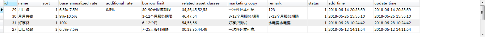

# 数据库表记录
## 首页分类表 `gjj_borrow_classification`   
```
SELECT  id,name,sort,base_annualized_rate,additional_rate,borrow_limit,related_asset_classes,marketing_copy,remark,status,add_time,update_time
from gjj_borrow_classification
where status = 1
order by sort
```

