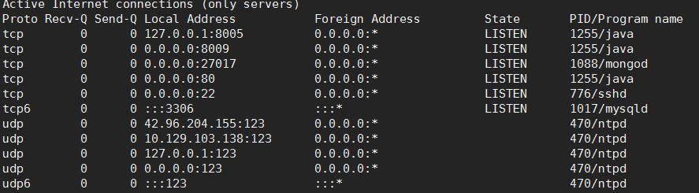
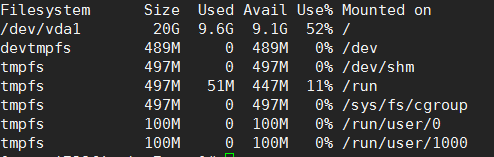

#### 查看进程号和监听的pid
`1. root用户执行netstat -ntupl n表示不查询dns t表示tcp协议 u表示udp协议 p表示查询占用的程序 l表示查询正在监听的程序
`

#### 查看磁盘空间
`df -h`  

#### 软件中断
是指cpu正在工作时，有软件发送请求，导致cpu必须放下手中的事情转而去处理请求。

#### Top参数
RES：resident memory usage 常驻内存        进程当前使用的内存大小，但不包括swap out  
SHR：shared memory 共享内存                   除了自身进程的共享内存，也包括其他进程的共享内存  
DATA     ：数据占用的内存。如果top没有显示，按f键可以显示出来。真正的该程序要求的数据空间，是真正在运行中要使用的。  
top三种load值，应该先看15分钟的，然后看5分钟和1分钟

#### linux查看本地地址
ifconfig

#### Linux软硬连接
1. 软连接 的两个文件有不同的inode 号，删除源文件将受影响，可以交叉文件系统，可以对目录创建 ln –s 源文件 目标文件   
2. 硬链接 的文件有多个相同的inode号，删除一个不影响，不可以交叉文件系统，不能对目录创建 ln 源文件 目标文件

#### 守护进程
加-d 让进程成为守护进程可以不用加CTRl +C

#### Zip压缩
zip -r filename.zip dirname

#### 查看CPU个数  
1. 查看物理CPU个数  
cat /proc/cpuinfo| grep "physical id"| sort| uniq| wc -l  
2. 查看每个物理CPU中core的个数(即核数)  
cat /proc/cpuinfo| grep "cpu cores"| uniq  
3. 查看逻辑CPU的个数  
cat /proc/cpuinfo| grep "processor"| wc -l  