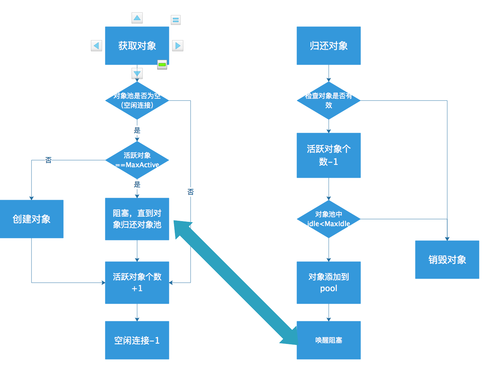

测试为主从架构，一主二从。整个负载均衡中只有一个cluster，即一致性hash环中只有一个节点。  
#### SSDB协议：
```
例子 set name zyq:
3
set
4 
name
3
zyq

例子 get name:
3
get
4
name
```
#### Spring配置：三台Server
```
<!-- 多台 SSDB 主从服务器的配置 -->
    <bean id="ssdbServer1" class="com.hyd.ssdb.conf.Server">
        <property name="host" value="127.0.0.1"/>
        <property name="port" value="9002"/>
        <property name="master" value="true"/>
    </bean>
    <bean id="ssdbServer2" class="com.hyd.ssdb.conf.Server">
        <property name="host" value="127.0.0.1"/>
        <property name="port" value="9003"/>
        <property name="master" value="false"/>
    </bean>
    
    <bean id="ssdbServer3" class="com.hyd.ssdb.conf.Server">
        <property name="host" value="127.0.0.1"/>
        <property name="port" value="9004"/>
        <property name="master" value="false"/>
    </bean>
    
    <bean id="singleClusterSsdbClient" class="com.hyd.ssdb.SsdbClient"
          factory-method="fromServers" destroy-method="close">
        <constructor-arg name="servers">
            <list value-type="com.hyd.ssdb.conf.Server">
                <ref bean="ssdbServer1"/>
                <ref bean="ssdbServer2"/>
                <ref bean="ssdbServer3"/>
            </list>
        </constructor-arg>
    </bean>
```

#### Server :每一台服务器，可以是主，也可以是从
```
    private String host;            // 服务器地址

    private int port;               // 服务器端口

    private String pass;            // 服务器校验密码（可选）

    private boolean master = true;  // 是否是主服务器。这个用于在初始化时候判断是否存放到Cluster
                                       节点的masterlist
     // 连接池配置参数,用于初始化ConnectionPool的参数之一
    private GenericObjectPoolConfig poolConfig = createDefaultPoolConfig();    

    private SocketConfig socketConfig = new SocketConfig();
```


#### 初始化过程：
1. Spring初始化  传入`List<Server> servers`     详情见上述配置
2. `Cluster cluster=Cluster.fromServers(servers)`  
用于将服务器集合转化为集群节点,同时配置集群节点的主节点
```
public Cluster(List<Server> servers, int weight) {

        servers.removeAll(Collections.singleton((Server) null));
        if (servers.isEmpty()) {
            throw new SsdbClientException("servers is empty");
        }

        this.servers = new ArrayList<Server>(servers);
        this.weight = weight;
        this.id = servers.get(0).getHost() + ":" + servers.get(0).getPort();

        fillMasters();
    }
```
```
// 将主服务器加入到 masters 列表
    private void fillMasters() {
        for (Server server : servers) {
            if (server.isMaster()) {
                this.masters.add(server);
            }
        }
    }
```
3. 将单个集群节点赋值给`sharding`的`clusters`  （用于接下来的分片）  
```
public Sharding(Cluster cluster) {
        this(Collections.singletonList(cluster));
}
```
```
public Sharding(List<Cluster> clusters) {

        // 清掉可能的 null 元素
        clusters.removeAll(Collections.singleton((Cluster) null));

        if (clusters.isEmpty()) {
            throw new SsdbClientException("clusters is empty");
        }

        this.clusters = new ArrayList<Cluster>(clusters);
}
```
4. 通过`sharding`创建`ConnectionPoolManager`
```
public AbstractClient(Sharding sharding) {
        this.connectionPoolManager = new ConnectionPoolManager(sharding);
}
```
```
public ConnectionPoolManager(Sharding sharding) {
        this.sharding = sharding;
        this.sharding.initClusters();
}
```
```
//clusters分片完成的实现
@Override
    public void initClusters() {

        if (clusters.isEmpty()) {
            return;
        } else {
            setClusterIdsIfDefault();
        }

        if (clusters.size() == 1) {
            setClusterRange(clusters.get(0), Integer.MIN_VALUE, Integer.MAX_VALUE);
            return;
        }

        // 计算所有权重总和
        int maxWeight = 0;
        for (Cluster cluster : clusters) {
            maxWeight += cluster.getWeight();
        }

        // 为每个权重分配 hash 段
        long maxrange = (long) Integer.MAX_VALUE - (long) Integer.MIN_VALUE;
        long weightcounter = 0;
        long pointer = 0;

        for (int i = 0; i < clusters.size(); i++) {
            Cluster cluster = clusters.get(i);
            int min, max;

            if (i == clusters.size() - 1) {
                // 如果是最后一个节点，则 max 设为 Integer 的最大值
                min = ((int) (pointer + Integer.MIN_VALUE) + 1);
                max = (Integer.MAX_VALUE);
                setClusterRange(cluster, min, max);

            } else {
                // 非最后一个节点，则
                // 如果是第一个节点，则 min 为 Integer 的最小值，否则 min 为上一个节点最大值 + 1
                min = i == 0 ? Integer.MIN_VALUE : (int) (pointer + Integer.MIN_VALUE) + 1;

                // 非最后节点的 max 值计算：根据 weight 计算节点的哈希段占比（含值个数），加上 min 值即可
                weightcounter += cluster.getWeight();
                pointer = maxrange * weightcounter / maxWeight;
                max = ((int) (pointer + Integer.MIN_VALUE));

                setClusterRange(cluster, min, max);
            }
        }
    }

        
    
```


#### 执行操作过程，以set为例
1. `PoolAndConnection poolAndConnection = connectionPoolManager.getConnection(request);`  
     从之前初始化的connectionPoolManager中通过request获取连接（协议部分自己看）  
     根据请求获取一个连接。如果 Cluster 的某个服务器无法创建连接，则自动切换  
     到其他可用的服务器；如果所有的服务器都不可用，则抛出 `SsdbNoServerAvailableException`  
     如果一个从节点挂了，就全去另一个从节点获取就是这里实现  
```
public PoolAndConnection getConnection(Request request)
                //通过key获取对应的cluster
                cluster = sharding.getClusterByKey(key);
                //从cluster中获取支持写操作的服务器的连接池
                connectionPool = pickServer(cluster, write);
                //从连接池中获取一个连接，这时才会去连接服务器，通过makeobject()
                Connection connection = connectionPool.borrowObject();
                return new PoolAndConnection(connectionPool, connection);
}


```

##### 1.1  通过key获取指定的cluster,(这个方法在上面的那个方法中)  
   在主从架构中由于只存在一个，故永远是那一个
```
@Override
    public Cluster getClusterByKey(String key) {

        if (noClusterAvailable()) {
            throw new SsdbNoClusterAvailableException("NO CLUSTER AVAILABLE");
        }

        int hash = MD5.md5Hash(key);

        for (Cluster cluster : clusters) {
            Cluster hostingCluster = cluster.getHashHostingCluster(hash);
            if (hostingCluster != null) {
                return hostingCluster;
            }
        }

        // 理论上 clusters 列表一定会包含 Integer 的所有值，
        // 所以执行到这里表示所有的 Cluster 都不可用
        throw new SsdbException("Unable to choose a cluster for key '" + key + "'");
    }
```

##### 1.2 获取连接池

```
synchronized (server) {

            //判断ConnectionPoolManager是否有这台服务器对应的连接池
            if (connectionPoolMap.containsKey(server)) {
                return connectionPoolMap.get(server);
            }
            //创建连接池
            ConnectionPool connectionPool = createConnectionPool(server);
            connectionPool.setTestOnReturn(true);
            connectionPool.setTestOnBorrow(true);
            //存入map中
            connectionPoolMap.put(server, connectionPool);
            return connectionPool;
}

private ConnectionPool createConnectionPool(Server server) {
        return new ConnectionPool(server);
}
          //配置连接池的factory和config配置
public ConnectionPool(Server server) {
        super(new ConnectionFactory(server));
        setConfig(server.getPoolConfig());
    }
```

##### 1.3 从连接池中获取连接
`Connection connection = connectionPool.borrowObject();`
```
public PooledObject<Connection> makeObject() throws Exception {
        LOG.debug("Creating connection with " + server);
        //进行数据库的连接便是在这里
        return new DefaultPooledObject<Connection>(new Connection(server));
    }
```
##### 1.4 连接池了解

###### 1.4.1 默认的连接池配置
```
public class GenericObjectPoolConfig extends BaseObjectPoolConfig {
    public static final int DEFAULT_MAX_TOTAL = 8;
    public static final int DEFAULT_MAX_IDLE = 8;
    public static final int DEFAULT_MIN_IDLE = 0;
    private int maxTotal = 8;
    private int maxIdle = 8;
    private int minIdle = 0;

    public GenericObjectPoolConfig() {
    }
```
###### 1.4.2 连接池的实现  GenericObjectPool
```
public GenericObjectPool(PooledObjectFactory<T> factory, GenericObjectPoolConfig config) {
        super(config, "org.apache.commons.pool2:type=GenericObjectPool,name=", config.getJmxNamePrefix());
        this.factoryType = null;
        this.maxIdle = 8;
        this.minIdle = 0;
        this.allObjects = new ConcurrentHashMap();
        this.createCount = new AtomicLong(0L);
        this.abandonedConfig = null;
        if(factory == null) {
            this.jmxUnregister();
            throw new IllegalArgumentException("factory may not be null");
        } else {
            this.factory = factory;
            this.idleObjects = new LinkedBlockingDeque(config.getFairness());
            this.setConfig(config);
            this.startEvictor(this.getTimeBetweenEvictionRunsMillis());
        }
    }
```
需要传入两个参数，Factory和Config,用于初始化实例。
当通过Pool中获取对象时，需要调用它的borrowObject方法（）,然后调用工厂的makeObject获取对象，所以需要重写该方法
```
设置最大等待时间
public T borrowObject() throws Exception {
        return this.borrowObject(this.getMaxWaitMillis());
    }

创建对象
private PooledObject<T> create() throws Exception {
        int localMaxTotal = this.getMaxTotal();
        long newCreateCount = this.createCount.incrementAndGet();
        if((localMaxTotal <= -1 || newCreateCount <= (long)localMaxTotal) && newCreateCount <= 2147483647L) {
            PooledObject p;
            try {
                p = this.factory.makeObject();
            } catch (Exception var6) {
                this.createCount.decrementAndGet();
                throw var6;
            }
         
    }
调用重写的makeObject获取对象
public PooledObject<Connection> makeObject() throws Exception {
        LOG.debug("Creating connection with " + server);
        return new DefaultPooledObject<Connection>(new Connection(server));
    }
返回对象给连接池
finally {
                if (connection != null) {
                    connectionPool.returnObject(connection);  // 把连接返回给连接池
                }
```
最简单的流程就是这样了，由于取和还的流程步骤都在borrowObject和returnObject方法中固定的，  
所以我们只要重写Factory工厂类的makeObject()和validateObject以及destroyObject方法即可实现最简单的池的管理控制

##### 1.5 发送请求
发送请求就是建立tcp长连接，在这个基础上按照协议组装，转化成字节，向服务端发送数据。这个驱动包默认是UTF-8
```
private Response sendRequest(Request request, Connection connection) {
        try {
            connection.send(request.toBytes());
            Response response = connection.receivePacket();
            checkResponse(request.getHeader().toString(), response);
            return response;

        } catch (SsdbException e) {
            throw e;
        } catch (Exception e) {
            throw new SsdbException(e);
        }
    }
```

##### 1.6 从节点故障处理机制
```
//将这台服务器放到自己监视列表中，并将它从集群几点中删除
public void reportInvalidConnection(Connection connection) {
        String host = connection.getProperty("host");
        Integer port = connection.getProperty("port");
//        reportInvalidConnection(host, port);
        reportInvalidConnectionNew(connection.getServer());
    }

//将需要删除的服务器默认设为了true服务器，导致删除后继续恢复的服务器为master,故重写一个
    public void reportInvalidConnection(String host, int port) {
        Server toInvalidate = new Server(host, port);
        for (Cluster cluster : sharding.getClusters()) {
            if (cluster.containsServer(toInvalidate)) {
                cluster.markInvalid(toInvalidate);
            }
        }
    }
    /**
     * @param Invalidserver  需要被监视的服务器
     * @author trotyzyq
     */
    public void reportInvalidConnectionNew(Server toInvalidate) {
        for (Cluster cluster : sharding.getClusters()) {
            if (cluster.containsServer(toInvalidate)) {
                cluster.markInvalid(toInvalidate);
            }
        }
    }

//具体实现
public synchronized void markInvalid(Server invalid) {
        LOG.error("Server unavailable: " + invalid);

        this.servers.remove(invalid);
        if (invalid.isMaster()) {
            this.masters.remove(invalid);
            //随机从运行正常的从机中获取一台
            Server server = this.getRandomServer();
            //晋升为主机，并放入masters中
            server.setMaster(true);
            this.masters.add(server);
        }

        if (!this.invalidServers.contains(invalid)) {
            this.invalidServers.add(invalid);
        }

        ServerMonitorDaemon.addInvalidServer(invalid, this);
    }

//每15秒进行一次检查，判断故障服务器是否恢复
private void runSafe() throws Exception {

            // 无需监视的服务器列表（在当前线程中删除）
            final Set<Server> noMonitoringServers = new HashSet<Server>();

            for (final Server server : invalidServers.keySet()) {

                final List<Cluster> clusters = invalidServers.get(server);

                // 删除不再包含该 Server 的 Cluster
                Iterator<Cluster> itClusters = clusters.iterator();
                while (itClusters.hasNext()) {
                    Cluster cluster = itClusters.next();
                    if (!cluster.containsServer(server)) {
                        itClusters.remove();
                    }
                }

                // 所有 Cluster 都没有包含该 Server，无需再监视了
                if (clusters.isEmpty()) {
                    noMonitoringServers.add(server);
                    continue;
                }

                // Server 正在检查当中，无需重复添加任务
                if (checkingServers.contains(server)) {
                    continue;
                } else {
                    checkingServers.add(server);
                }

//恢复节点
public synchronized void markValid(Server server) {
        LOG.info("Server restored: " + server);
        //如果是主机，就将原来的主机转化成备机，现在的机子变成主机
        if(server.isMaster()) {
        	//获取之前放进去的最后一台机子，因为之前放进去的从机是最后一台,然后删掉
        	Server slaveServer=this.masters.get(masters.size()-1);
        	this.masters.remove(masters.size()-1);
        	slaveServer.setMaster(false);
        	this.masters.add(server);
        }
        this.servers.add(server);
        
//        if (server.isMaster()) {
//            this.masters.add(server);
//        }

        if (this.invalidServers.contains(server)) {
            this.invalidServers.remove(server);
        }

        if (this.invalid) {
            this.invalid = false;
        }
    }
```


