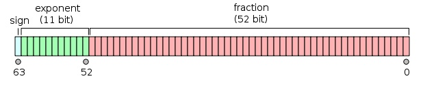

# Python原理
1. pyhton是一门解释性语言，可以对程序直接进行解释，并执行，因此效率会比较低。但是为了效率，pyhton也可以产生字节码。

# Python 基本数据类型 
## int
1. Python 的标准整数类型是最通用的数字类型。  
2. 在大多数 32 位机器上，标准整数类型的取 值范围是-231 到 231-1，也就是-2,147,483,648 到 2,147,483,647。  
3. 如果在 64 位机器上使 用 64 位编译器编译 Python，那么在这个系统上的整数将是 64 位。  
## long
1. python长整型和C或者Java的长整型有所区别。
2. Python 的长整数类型能表达的 数值仅仅与你的机器支持的(虚拟)内存大小有关， 换句话说， Python 能轻松表达很大很大很大的整数。
3. 用x=999L表示。Python 3.x中移除了long类型。3.x中的int基本等同于2.x中的long，只是没有L后缀。
## float
1. Python 中的浮点数类似 C 语言中的 double 类型， 是双精度浮点数，可以用直接的十进制 或科学计数法表示。  
   每个浮点数占 8 个字节（64 比特），完全遵守 IEEE754 号规范（52M/11E/1S）， 其中 52 个比特用于表示底，11 个比特用于表示指数（可表示的范围大约是正负 10 的 308.25 次方）， 剩下的一个比特表示符号。
   
 2. 单精度和双精度的区别在于双精度能存放的范围比较大，但是耗费的空间也比较大。如下图：
 
 

## bool
## complex

# Python编码格式
## 什么是utf-8
1. 是把`Unicode`数据编码成字节数据的规则，是一种编码方式。而unicode只是一种编码。
## Python2
```
>>> s1 = '中'
>>> print type(s1)
<type 'str'>
>>> print repr(s1)
'\xd6\xd0'

>>> s2 = u'中'
>>> print type(s2)
<type 'unicode'>
>>> print repr(s2)
u'\u4e2d'
```
1. python2字符串默认编码是ascll。指在编码或者解码的过程中，如果不指定编码，默认用ascii编码。  
  `s.encode("utf-8") 等价于 s.decode(defaultencoding).encode("utf-8")`  
2. 不加 `u`的话会转化为byte。  
   字符串有两种type，一种是str,存储格式是bytes;另一种是unicode,存储的是unicode。  
   [1](https://www.jianshu.com/p/bb5ebed1f9c1)
   [2](https://www.cnblogs.com/whiterock/p/8176392.html)
   [3](https://www.jianshu.com/p/5682a0e0a9ba)
3. 头文件加coding指的是将默认编码ascii转为utf-8。  
4. 不同的控制台或者ide用的编码方式都是不一样的。就像python2控制台用的是utf-8,  
    输入中文后转化的是utf-8编码的字节, pycharm也是utf-8。

## Python3
1. python3字符串默认是unicde,解释器默认编码是utf-8。
2. 字符串有两种type，分别为bytes和str,存储格式分别为byte和unicode

## 编码与程序运行的关系
编写Python代码一般会用到sublime，pycharm，vim等软件。而代码文件的创建、保存、执行等过程就伴随着编解码流程。下面以pycharm为例介绍这一过程。
1. 使用pycharm创建hello.py文件，当我们保存的的时候，hello.py文件就以pycharm默认的编码方式保存到了磁盘；
2. 关闭文件后再打开，pycharm就再以默认的编码方式对该文件打开后读到的内容进行解码，转成unicode到内存我们就看到了我们的明文；
3. 而如果我们点击运行按钮或者在命令行运行该文件时，Python解释器这个软件就会被调用，打开文件，然后将存储在磁盘上的bytes数据解码成unicode数据。
4. 这个过程和编辑器是一样的，不同的是解释器会再将这些unicode数据翻译成C代码再转成二进制的数据流，最后通过控制操作系统调用cpu来执行这些二进制数据，整个过程才算结束。
5. py2解释器默认ASCII码，py3解释器默认的utf8，

## python2中u和unicode的区别
1. u1=u"章御强"  
    这边是用linux的控制台实现的，由于控制台是utf-8编码，这个过程其实是先将“章御强”转化为字节  
    然后字节用控制台编码进行解码，就是unicode字符了。和代码文件用ide的编码保存为字节，然后再解码  
    一样。  
2. u2=unicode("章御强")   ====u2=unicide("章御强",defaultcharset)  
    这边其实已经调用了python解释器，由于py2解释器是用ascii编码的，所以肯定报错。  
    如何证明:先设定解释器默认编码为gbk,然后将unicode用gbk编码，最后调用上面的unicode方法。  

# Pyhton3数据结构
## 字符串格式化
```
# -*- coding: UTF-8 -*-
s1=88;
s2=99;
print(r)
msg='%d,%d,%.2f' % (s1,s2,r)
msg2='{0} {1} {2:.2f}'.format(s1,s2,r)
print(msg)
print(msg2)
```

## list
1. 从倒数第一个获取   L[-1]
2. 添加数据  L.addend(4)
3. 插入数据 L.insert(1,'5')  原理其实是引用指向5这个元素，然后1之后的引用向起点移一位。
4. list里面的元素的数据类型也可以不同  L = ['Apple', 123, True]

## tuple 
1. 定义空的元组 t=()
2. 定义只有一个数为1的元组，t=(1)
3. 定义只有一个元素的元组  t=(1,)
4. tuple的指向永远不能变  和java的final一样，引用不能变
## dict (类似于java的Map)
1. `d={1:[1,2]}`  
2.  `d[1]=1`  除了初始化指定值，还可以通过下标设置值
3.  要删除一个key，用pop(key)方法
4. dict不能存放不变对象的key,例如list或者tuple里加list。原因是：无法通过hash定位到value。   
    java中是可以的，但是你得重写equals和hashcode这两个方法。

## set(类似于hashset)
1. s = set([1, 1, 2, 2, 3, 3])
2. s = set((1, 1, 2, 2, 3, 3))

## 数据结构原理分析
### list分析
1. list内部应该是一个数组，所以能用切片和下标访问，不然速度不可能那么快。
2. list有insert方法，而java的arraylist没有。 
   原因：时间复杂度为O(n),在数据量大的情况下效率低。
### tuple分析
1. tuple作为不可变对象指：tuple的应用不可变。可能是用了和java final类似的关键字。
2. tuple的实现应该也是和list类似，也是数组。这就能解释为什么set中可以存放list和tuple

### dict
1.  dict不能存放不变对象的key,例如list或者tuple里加list?  
    原因是：无法通过hash定位到value。   
    java中是可以的，但是你得重写equals和hashcode这两个方法。  
2. dict是如何处理冲突的？  
    用了链表法，即数组加链表。从d={1:2,1:4,2:5}，s=set(d)   ,s=>>{1, 3}可以看出，
3. dict不是序列，无法进行迭代
### set分析
1. set应该是利用dict即hashtable,从而实现不重复，应该重复的值已经覆盖了。


# Python3函数
## 解释
1. 函数名其实就是指向一个函数对象的引用，完全可以把函数名赋给一个变量，
   相当于给这个函数起了一个“别名”：
## 返回多个值
```
def move(x, y, step, angle=0):
    nx = x + step * math.cos(angle)
    ny = y - step * math.sin(angle)
    return nx, ny
```
其实是返回一个`tuple`
## 默认参数
```
def power(x, n=2):
    s = 1
    while n > 0:
        n = n - 1
        s = s * x
    return s
```
1. 必选参数在前，默认参数在后，否则Python的解释器会报错。如果在中间，会导致调用模糊
2. 如何设置默认参数

## 可变参数
```
def calc(*numbers):
    sum = 0
    for n in numbers:
        sum = sum + n * n
    return sum

调用：
    calc([1, 2, 3])
    calc((1, 3, 5, 7))
    calc(1, 2, 3)
    nums = [1, 2, 3]   calc(*nums)
```

## 关键字参数
```
def person(name, age, **kw):
    print('name:', name, 'age:', age, 'other:', kw)

调用：
    person('Michael', 30)
    person('Bob', 35, city='Beijing')
    person('Adam', 45, gender='M', job='Engineer')
```

# 高级特性
1. 生成器:用圆括号表示
```
numbers = [1, 2, 3, 5, 7]
squares = (n*n for n in numbers)
for n in squares:
    print (n)
```