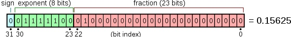

# Python原理
1. pyhton是一门解释性语言，可以对程序直接进行解释，并执行，因此效率会比较低。但是为了效率，pyhton也可以产生字节码。

# Python 基本数据类型 
## int
1. Python 的标准整数类型是最通用的数字类型。  
2. 在大多数 32 位机器上，标准整数类型的取 值范围是-231 到 231-1，也就是-2,147,483,648 到 2,147,483,647。  
3. 如果在 64 位机器上使 用 64 位编译器编译 Python，那么在这个系统上的整数将是 64 位。  
## long
1. python长整型和C或者Java的长整型有所区别。
2. Python 的长整数类型能表达的 数值仅仅与你的机器支持的(虚拟)内存大小有关， 换句话说， Python 能轻松表达很大很大很大的整数。
3. 用x=999L表示。Python 3.x中移除了long类型。3.x中的int基本等同于2.x中的long，只是没有L后缀。
## float
1. Python 中的浮点数类似 C 语言中的 double 类型， 是双精度浮点数，可以用直接的十进制 或科学计数法表示。  
   每个浮点数占 8 个字节（64 比特），完全遵守 IEEE754 号规范（52M/11E/1S）， 其中 52 个比特用于表示底，11 个比特用于表示指数（可表示的范围大约是正负 10 的 308.25 次方）， 剩下的一个比特表示符号。
   
 2. 单精度和双精度的区别在于双精度能存放的范围比较大，但是耗费的空间也比较大。如下图：
 
 

## bool
## complex

# Python编码格式
## 什么是utf-8
1. 是把`Unicode`数据编码成字节数据的规则，是一种编码方式。而unicode只是一种编码。
## Python2
```
>>> s1 = '中'
>>> print type(s1)
<type 'str'>
>>> print repr(s1)
'\xd6\xd0'

>>> s2 = u'中'
>>> print type(s2)
<type 'unicode'>
>>> print repr(s2)
u'\u4e2d'
```
1. python2字符串默认编码是ascll。不加 `u`的话会转化为byte。
   字符串有两种type，一种是str,存储格式是bytes;另一种是unicode,存储的是unicode。
   [1](https://www.jianshu.com/p/bb5ebed1f9c1)
   [2](https://www.cnblogs.com/whiterock/p/8176392.html)
   [3](https://www.jianshu.com/p/5682a0e0a9ba)
1. python3默认编码格式为UTF-8,字符串有byte和unicode
